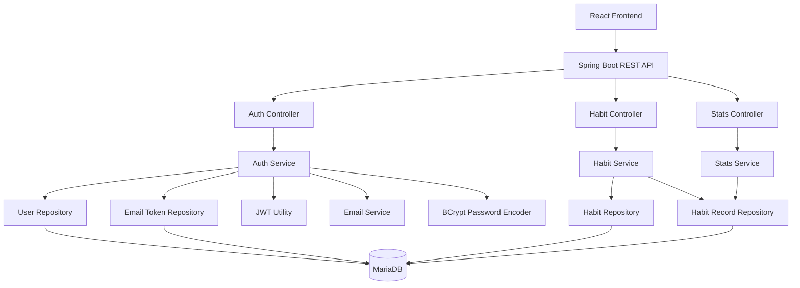
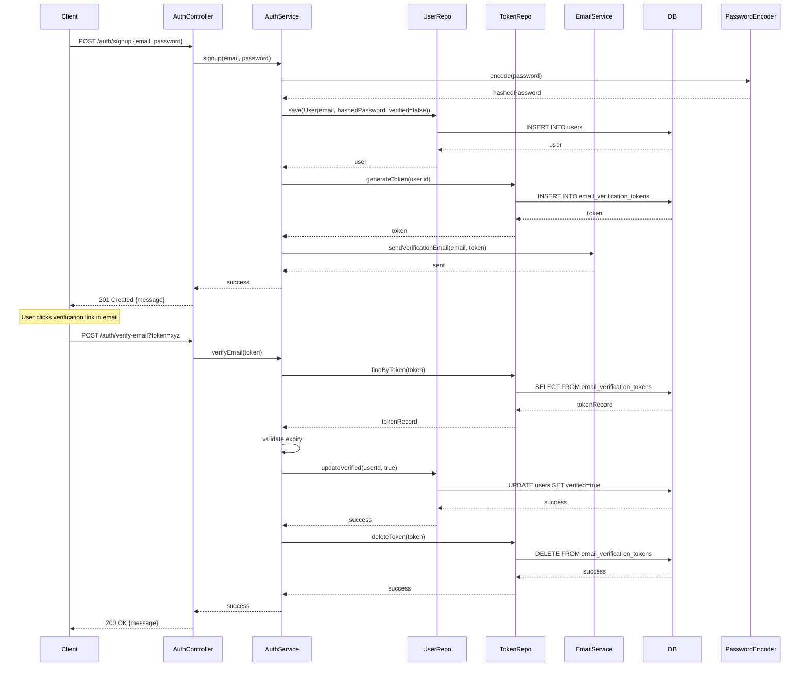
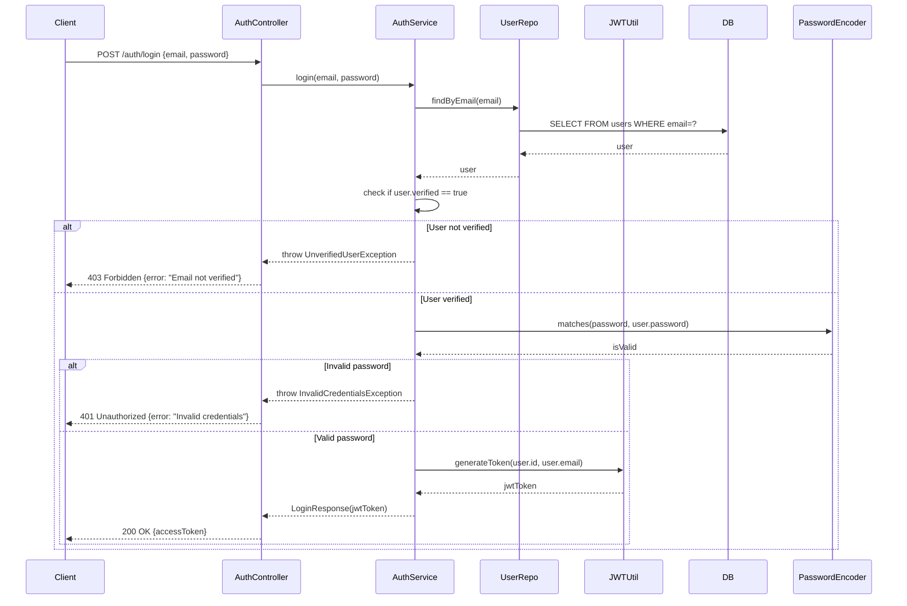
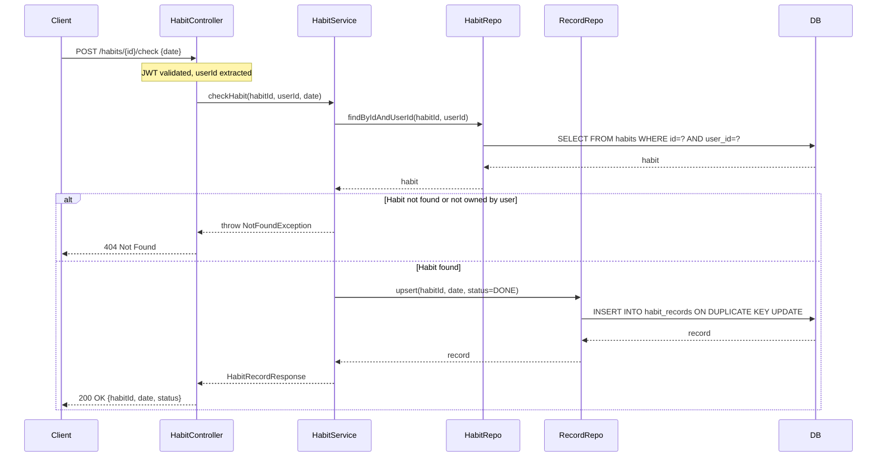
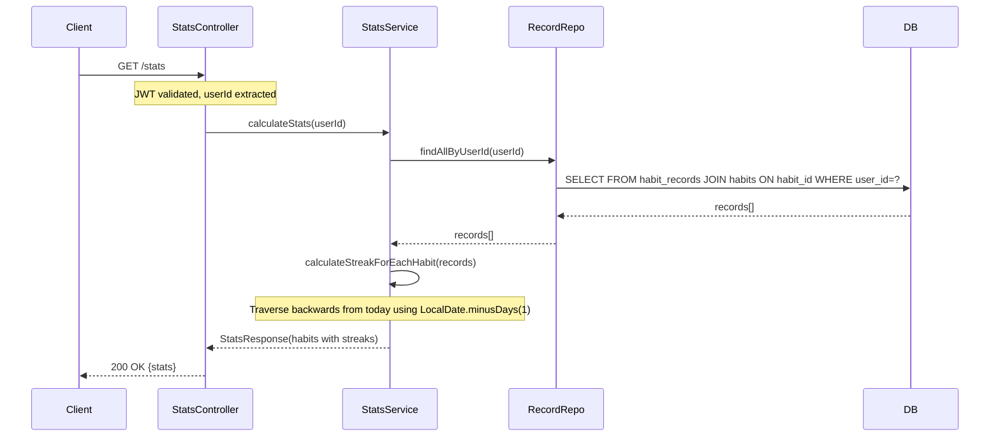

# Design Document: Habit Tracker Phase 1 (MVP)

## Overview

The Habit Tracker Phase 1 MVP is a production-ready habit tracking system built with Kotlin + Spring Boot backend and React frontend. The system enables users to create accounts with email verification, manage daily habits, track completion records, and view analytics including dynamically calculated streaks. The architecture follows a layered approach (Controller → Service → Repository → DB) with MariaDB 11.8.2 as the persistence layer. Key design decisions include using LocalDate for timezone-safe date handling, deriving streaks dynamically from habit_records rather than storing them, and enforcing one record per habit per day via database constraints.

## Architecture



## Sequence Diagrams

### User Signup and Email Verification Flow



### Login Flow



### Habit Check (Daily Tracking) Flow




### Streak Calculation Flow



## Components and Interfaces

### Component 1: AuthController

**Purpose**: Handles HTTP requests for user authentication (signup, email verification, login)

**Interface**:
```kotlin
@RestController
@RequestMapping("/auth")
class AuthController(private val authService: AuthService) {
    
    @PostMapping("/signup")
    fun signup(@Valid @RequestBody request: SignupRequest): ResponseEntity<MessageResponse>
    
    @PostMapping("/verify-email")
    fun verifyEmail(@RequestParam token: String): ResponseEntity<MessageResponse>
    
    @PostMapping("/login")
    fun login(@Valid @RequestBody request: LoginRequest): ResponseEntity<LoginResponse>
}
```

**Responsibilities**:
- Validate incoming request DTOs using Bean Validation
- Delegate business logic to AuthService
- Return appropriate HTTP status codes and response bodies
- Handle exceptions and map to HTTP error responses

### Component 2: HabitController

**Purpose**: Handles HTTP requests for habit CRUD operations and daily tracking

**Interface**:
```kotlin
@RestController
@RequestMapping("/habits")
class HabitController(private val habitService: HabitService) {
    
    @GetMapping
    fun getHabits(@AuthenticationPrincipal userId: Long): ResponseEntity<List<HabitResponse>>
    
    @PostMapping
    fun createHabit(
        @AuthenticationPrincipal userId: Long,
        @Valid @RequestBody request: CreateHabitRequest
    ): ResponseEntity<HabitResponse>
    
    @PatchMapping("/{id}")
    fun updateHabit(
        @PathVariable id: Long,
        @AuthenticationPrincipal userId: Long,
        @Valid @RequestBody request: UpdateHabitRequest
    ): ResponseEntity<HabitResponse>
    
    @DeleteMapping("/{id}")
    fun deleteHabit(
        @PathVariable id: Long,
        @AuthenticationPrincipal userId: Long
    ): ResponseEntity<Void>
    
    @PostMapping("/{id}/check")
    fun checkHabit(
        @PathVariable id: Long,
        @AuthenticationPrincipal userId: Long,
        @Valid @RequestBody request: CheckHabitRequest
    ): ResponseEntity<HabitRecordResponse>
}
```

**Responsibilities**:
- Extract authenticated user ID from JWT token via @AuthenticationPrincipal
- Validate request DTOs
- Delegate to HabitService
- Return appropriate responses


### Component 3: StatsController

**Purpose**: Handles HTTP requests for analytics and statistics

**Interface**:
```kotlin
@RestController
@RequestMapping("/stats")
class StatsController(private val statsService: StatsService) {
    
    @GetMapping
    fun getStats(@AuthenticationPrincipal userId: Long): ResponseEntity<StatsResponse>
}
```

**Responsibilities**:
- Extract authenticated user ID
- Delegate to StatsService for streak calculation
- Return statistics including dynamically calculated streaks

### Component 4: AuthService

**Purpose**: Business logic for authentication, email verification, and JWT token generation

**Interface**:
```kotlin
@Service
class AuthService(
    private val userRepository: UserRepository,
    private val emailVerificationTokenRepository: EmailVerificationTokenRepository,
    private val passwordEncoder: PasswordEncoder,
    private val jwtUtil: JwtUtil,
    private val emailService: EmailService
) {
    
    fun signup(email: String, password: String): User
    
    fun verifyEmail(token: String): Unit
    
    fun login(email: String, password: String): String
}
```

**Responsibilities**:
- Hash passwords using BCrypt
- Generate and validate email verification tokens
- Validate user credentials
- Check if user is verified before allowing login
- Generate JWT access tokens
- Send verification emails

### Component 5: HabitService

**Purpose**: Business logic for habit management and daily tracking

**Interface**:
```kotlin
@Service
class HabitService(
    private val habitRepository: HabitRepository,
    private val habitRecordRepository: HabitRecordRepository
) {
    
    fun getHabits(userId: Long): List<Habit>
    
    fun createHabit(userId: Long, name: String, frequencyType: FrequencyType): Habit
    
    fun updateHabit(habitId: Long, userId: Long, name: String?): Habit
    
    fun deleteHabit(habitId: Long, userId: Long): Unit
    
    fun checkHabit(habitId: Long, userId: Long, date: LocalDate): HabitRecord
}
```

**Responsibilities**:
- Validate habit ownership (user can only modify their own habits)
- Enforce DAILY frequency type for MVP
- Create/update/delete habits
- Record habit completion using upsert logic (INSERT ON DUPLICATE KEY UPDATE)
- Ensure one record per habit per day


### Component 6: StatsService

**Purpose**: Business logic for calculating streaks and statistics

**Interface**:
```kotlin
@Service
class StatsService(
    private val habitRecordRepository: HabitRecordRepository,
    private val habitRepository: HabitRepository
) {
    
    fun calculateStats(userId: Long): StatsResponse
    
    fun calculateStreak(habitId: Long): Int
}
```

**Responsibilities**:
- Fetch all habit records for a user
- Calculate current streak by traversing backwards from today
- Use LocalDate.minusDays(1) for date arithmetic
- Return statistics including streak, total completions, etc.

### Component 7: JwtUtil

**Purpose**: Utility for JWT token generation and validation

**Interface**:
```kotlin
@Component
class JwtUtil(
    @Value("\${jwt.secret}") private val secret: String,
    @Value("\${jwt.expiration}") private val expiration: Long
) {
    
    fun generateToken(userId: Long, email: String): String
    
    fun validateToken(token: String): Boolean
    
    fun extractUserId(token: String): Long
    
    fun extractEmail(token: String): String
}
```

**Responsibilities**:
- Generate JWT tokens with user ID and email as claims
- Sign tokens with secret key
- Validate token signature and expiration
- Extract claims from tokens

### Component 8: EmailService

**Purpose**: Send email notifications (verification emails)

**Interface**:
```kotlin
@Service
class EmailService {
    
    fun sendVerificationEmail(email: String, token: String): Unit
}
```

**Responsibilities**:
- Send email verification links to users
- Format email content with verification URL
- Handle email sending failures gracefully

## Data Models

### Model 1: User

```kotlin
@Entity
@Table(name = "users")
data class User(
    @Id
    @GeneratedValue(strategy = GenerationType.IDENTITY)
    val id: Long = 0,
    
    @Column(unique = true, nullable = false)
    val email: String,
    
    @Column(nullable = false)
    val password: String,
    
    @Column(nullable = false)
    val verified: Boolean = false,
    
    @Column(name = "created_at", nullable = false)
    val createdAt: LocalDateTime = LocalDateTime.now()
)
```

**Validation Rules**:
- email must be valid email format and unique
- password must be at least 8 characters (validated before hashing)
- verified defaults to false
- createdAt auto-generated


### Model 2: EmailVerificationToken

```kotlin
@Entity
@Table(name = "email_verification_tokens")
data class EmailVerificationToken(
    @Id
    @GeneratedValue(strategy = GenerationType.IDENTITY)
    val id: Long = 0,
    
    @Column(name = "user_id", nullable = false)
    val userId: Long,
    
    @Column(unique = true, nullable = false)
    val token: String,
    
    @Column(name = "expiry_date", nullable = false)
    val expiryDate: LocalDateTime
)
```

**Validation Rules**:
- token must be unique (UUID recommended)
- expiryDate typically set to 24 hours from creation
- userId must reference existing user

### Model 3: Habit

```kotlin
@Entity
@Table(name = "habits")
data class Habit(
    @Id
    @GeneratedValue(strategy = GenerationType.IDENTITY)
    val id: Long = 0,
    
    @Column(name = "user_id", nullable = false)
    val userId: Long,
    
    @Column(nullable = false)
    val name: String,
    
    @Column(name = "frequency_type", nullable = false)
    @Enumerated(EnumType.STRING)
    val frequencyType: FrequencyType = FrequencyType.DAILY,
    
    @Column(name = "created_at", nullable = false)
    val createdAt: LocalDateTime = LocalDateTime.now()
)

enum class FrequencyType {
    DAILY
}
```

**Validation Rules**:
- name must not be blank, max 100 characters
- frequencyType must be DAILY for Phase 1
- userId must reference existing user
- createdAt auto-generated

### Model 4: HabitRecord

```kotlin
@Entity
@Table(
    name = "habit_records",
    uniqueConstraints = [UniqueConstraint(columnNames = ["habit_id", "date"])]
)
data class HabitRecord(
    @Id
    @GeneratedValue(strategy = GenerationType.IDENTITY)
    val id: Long = 0,
    
    @Column(name = "habit_id", nullable = false)
    val habitId: Long,
    
    @Column(nullable = false)
    val date: LocalDate,
    
    @Column(nullable = false)
    @Enumerated(EnumType.STRING)
    val status: RecordStatus = RecordStatus.DONE
)

enum class RecordStatus {
    DONE
}
```

**Validation Rules**:
- habitId must reference existing habit
- date must be valid LocalDate
- UNIQUE constraint on (habit_id, date) enforces one record per habit per day
- status is DONE for Phase 1 (future: SKIPPED, MISSED)


### Model 5: Request/Response DTOs

```kotlin
// Auth DTOs
data class SignupRequest(
    @field:Email(message = "Invalid email format")
    @field:NotBlank(message = "Email is required")
    val email: String,
    
    @field:Size(min = 8, message = "Password must be at least 8 characters")
    @field:NotBlank(message = "Password is required")
    val password: String
)

data class LoginRequest(
    @field:Email(message = "Invalid email format")
    @field:NotBlank(message = "Email is required")
    val email: String,
    
    @field:NotBlank(message = "Password is required")
    val password: String
)

data class LoginResponse(
    val accessToken: String
)

data class MessageResponse(
    val message: String
)

// Habit DTOs
data class CreateHabitRequest(
    @field:NotBlank(message = "Habit name is required")
    @field:Size(max = 100, message = "Habit name must not exceed 100 characters")
    val name: String
)

data class UpdateHabitRequest(
    @field:Size(max = 100, message = "Habit name must not exceed 100 characters")
    val name: String?
)

data class HabitResponse(
    val id: Long,
    val name: String,
    val frequencyType: String,
    val createdAt: String
)

data class CheckHabitRequest(
    @field:NotNull(message = "Date is required")
    val date: LocalDate
)

data class HabitRecordResponse(
    val habitId: Long,
    val date: LocalDate,
    val status: String
)

// Stats DTOs
data class StatsResponse(
    val habits: List<HabitStats>
)

data class HabitStats(
    val habitId: Long,
    val habitName: String,
    val currentStreak: Int,
    val totalCompletions: Int
)
```

## Algorithmic Pseudocode

### Algorithm 1: User Signup

```kotlin
fun signup(email: String, password: String): User {
    // Preconditions:
    // - email is valid email format
    // - password is at least 8 characters
    // - email does not already exist in database
    
    // Step 1: Hash password
    val hashedPassword = passwordEncoder.encode(password)
    
    // Step 2: Create user with verified=false
    val user = User(
        email = email,
        password = hashedPassword,
        verified = false
    )
    val savedUser = userRepository.save(user)
    
    // Step 3: Generate verification token
    val token = UUID.randomUUID().toString()
    val expiryDate = LocalDateTime.now().plusHours(24)
    val verificationToken = EmailVerificationToken(
        userId = savedUser.id,
        token = token,
        expiryDate = expiryDate
    )
    emailVerificationTokenRepository.save(verificationToken)
    
    // Step 4: Send verification email
    emailService.sendVerificationEmail(email, token)
    
    // Postconditions:
    // - User created with verified=false
    // - Verification token created and stored
    // - Verification email sent
    
    return savedUser
}
```


### Algorithm 2: Email Verification

```kotlin
fun verifyEmail(token: String): Unit {
    // Preconditions:
    // - token is non-empty string
    
    // Step 1: Find token in database
    val verificationToken = emailVerificationTokenRepository.findByToken(token)
        ?: throw InvalidTokenException("Invalid or expired token")
    
    // Step 2: Check if token is expired
    if (LocalDateTime.now().isAfter(verificationToken.expiryDate)) {
        emailVerificationTokenRepository.delete(verificationToken)
        throw InvalidTokenException("Token has expired")
    }
    
    // Step 3: Update user verified status
    val user = userRepository.findById(verificationToken.userId)
        ?: throw UserNotFoundException("User not found")
    
    val updatedUser = user.copy(verified = true)
    userRepository.save(updatedUser)
    
    // Step 4: Delete used token
    emailVerificationTokenRepository.delete(verificationToken)
    
    // Postconditions:
    // - User verified status set to true
    // - Verification token deleted
}
```

### Algorithm 3: User Login

```kotlin
fun login(email: String, password: String): String {
    // Preconditions:
    // - email is valid email format
    // - password is non-empty
    
    // Step 1: Find user by email
    val user = userRepository.findByEmail(email)
        ?: throw InvalidCredentialsException("Invalid email or password")
    
    // Step 2: Check if user is verified
    if (!user.verified) {
        throw UnverifiedUserException("Email not verified. Please check your email.")
    }
    
    // Step 3: Validate password
    if (!passwordEncoder.matches(password, user.password)) {
        throw InvalidCredentialsException("Invalid email or password")
    }
    
    // Step 4: Generate JWT token
    val jwtToken = jwtUtil.generateToken(user.id, user.email)
    
    // Postconditions:
    // - Valid JWT token returned
    // - Token contains user ID and email as claims
    
    return jwtToken
}
```

### Algorithm 4: Create Habit

```kotlin
fun createHabit(userId: Long, name: String, frequencyType: FrequencyType): Habit {
    // Preconditions:
    // - userId exists in database
    // - name is non-blank and <= 100 characters
    // - frequencyType is DAILY (only supported in Phase 1)
    
    // Step 1: Validate frequency type
    if (frequencyType != FrequencyType.DAILY) {
        throw UnsupportedOperationException("Only DAILY frequency is supported in Phase 1")
    }
    
    // Step 2: Create habit
    val habit = Habit(
        userId = userId,
        name = name,
        frequencyType = frequencyType
    )
    
    // Step 3: Save to database
    val savedHabit = habitRepository.save(habit)
    
    // Postconditions:
    // - Habit created and persisted
    // - Habit belongs to specified user
    
    return savedHabit
}
```


### Algorithm 5: Check Habit (Daily Tracking)

```kotlin
fun checkHabit(habitId: Long, userId: Long, date: LocalDate): HabitRecord {
    // Preconditions:
    // - habitId exists in database
    // - userId is authenticated user
    // - date is valid LocalDate
    
    // Step 1: Verify habit ownership
    val habit = habitRepository.findByIdAndUserId(habitId, userId)
        ?: throw NotFoundException("Habit not found or access denied")
    
    // Step 2: Check if record already exists for this date
    val existingRecord = habitRecordRepository.findByHabitIdAndDate(habitId, date)
    
    // Step 3: Upsert record (create or update)
    val record = if (existingRecord != null) {
        // Update existing record
        existingRecord.copy(status = RecordStatus.DONE)
    } else {
        // Create new record
        HabitRecord(
            habitId = habitId,
            date = date,
            status = RecordStatus.DONE
        )
    }
    
    // Step 4: Save record
    val savedRecord = habitRecordRepository.save(record)
    
    // Postconditions:
    // - Exactly one record exists for (habitId, date)
    // - Record status is DONE
    // - Database constraint UNIQUE(habit_id, date) enforced
    
    return savedRecord
}
```

### Algorithm 6: Calculate Streak (CRITICAL - Timezone-Safe)

```kotlin
fun calculateStreak(habitId: Long): Int {
    // Preconditions:
    // - habitId exists in database
    
    // Step 1: Get all records for this habit, sorted by date descending
    val records = habitRecordRepository.findByHabitIdOrderByDateDesc(habitId)
    
    if (records.isEmpty()) {
        return 0
    }
    
    // Step 2: Initialize streak counter and current date
    var streak = 0
    var currentDate = LocalDate.now()
    
    // Step 3: Traverse backwards from today
    // Loop invariant: currentDate represents the next expected completion date
    for (record in records) {
        // Check if record matches current expected date
        if (record.date == currentDate && record.status == RecordStatus.DONE) {
            streak++
            currentDate = currentDate.minusDays(1)  // Move to previous day
        } else if (record.date.isBefore(currentDate)) {
            // Gap found - streak broken
            break
        }
        // If record.date is after currentDate, skip it (future date)
    }
    
    // Step 4: Handle edge case - if today is not completed, check yesterday
    if (streak == 0 && records.isNotEmpty()) {
        val yesterday = LocalDate.now().minusDays(1)
        if (records[0].date == yesterday && records[0].status == RecordStatus.DONE) {
            streak = 1
            currentDate = yesterday.minusDays(1)
            
            // Continue counting from yesterday
            for (i in 1 until records.size) {
                val record = records[i]
                if (record.date == currentDate && record.status == RecordStatus.DONE) {
                    streak++
                    currentDate = currentDate.minusDays(1)
                } else if (record.date.isBefore(currentDate)) {
                    break
                }
            }
        }
    }
    
    // Postconditions:
    // - Streak represents consecutive days from today (or yesterday if today not done)
    // - Uses LocalDate for timezone-safe date arithmetic
    // - Streak is always >= 0
    
    return streak
}
```


## Key Functions with Formal Specifications

### Function 1: passwordEncoder.encode()

```kotlin
fun encode(rawPassword: String): String
```

**Preconditions:**
- rawPassword is non-null and non-empty
- rawPassword length >= 8 characters

**Postconditions:**
- Returns BCrypt hashed password string
- Hash is irreversible (one-way function)
- Hash length is 60 characters
- Same input produces different hashes (due to salt)

**Loop Invariants:** N/A (no loops)

### Function 2: jwtUtil.generateToken()

```kotlin
fun generateToken(userId: Long, email: String): String
```

**Preconditions:**
- userId is positive integer
- email is valid email format

**Postconditions:**
- Returns valid JWT token string
- Token contains claims: userId, email, iat (issued at), exp (expiration)
- Token is signed with secret key
- Token expires after configured duration (e.g., 24 hours)
- Token format: header.payload.signature

**Loop Invariants:** N/A

### Function 3: habitRecordRepository.findByHabitIdOrderByDateDesc()

```kotlin
fun findByHabitIdOrderByDateDesc(habitId: Long): List<HabitRecord>
```

**Preconditions:**
- habitId is positive integer

**Postconditions:**
- Returns list of HabitRecord sorted by date in descending order
- List may be empty if no records exist
- All records in list have habitId matching input parameter
- Records are ordered: most recent date first

**Loop Invariants:** N/A (database query)

### Function 4: LocalDate.minusDays()

```kotlin
fun LocalDate.minusDays(days: Long): LocalDate
```

**Preconditions:**
- days is non-negative integer
- this LocalDate is valid

**Postconditions:**
- Returns new LocalDate representing date minus specified days
- Original LocalDate is immutable (not modified)
- Result is timezone-safe (no time component)
- Handles month/year boundaries correctly

**Loop Invariants:** N/A

## Example Usage

### Example 1: Complete User Signup and Login Flow

```kotlin
// Step 1: User signs up
val signupRequest = SignupRequest(
    email = "user@example.com",
    password = "securePassword123"
)
val user = authService.signup(signupRequest.email, signupRequest.password)
// User receives email with verification link

// Step 2: User clicks verification link
authService.verifyEmail("abc-123-def-456")
// User account is now verified

// Step 3: User logs in
val loginRequest = LoginRequest(
    email = "user@example.com",
    password = "securePassword123"
)
val jwtToken = authService.login(loginRequest.email, loginRequest.password)
// Returns: "eyJhbGciOiJIUzI1NiIsInR5cCI6IkpXVCJ9..."
```


### Example 2: Create Habit and Track Daily

```kotlin
// Step 1: Create a habit (authenticated request with JWT)
val createRequest = CreateHabitRequest(name = "Morning Exercise")
val habit = habitService.createHabit(
    userId = 1L,
    name = createRequest.name,
    frequencyType = FrequencyType.DAILY
)
// Returns: Habit(id=1, userId=1, name="Morning Exercise", frequencyType=DAILY)

// Step 2: Mark habit as done for today
val checkRequest = CheckHabitRequest(date = LocalDate.now())
val record = habitService.checkHabit(
    habitId = habit.id,
    userId = 1L,
    date = checkRequest.date
)
// Returns: HabitRecord(id=1, habitId=1, date=2024-01-15, status=DONE)

// Step 3: Mark habit as done for yesterday (backfill)
val yesterdayRecord = habitService.checkHabit(
    habitId = habit.id,
    userId = 1L,
    date = LocalDate.now().minusDays(1)
)
// Returns: HabitRecord(id=2, habitId=1, date=2024-01-14, status=DONE)
```

### Example 3: Calculate Streak

```kotlin
// Given habit records for habit ID 1:
// - 2024-01-15 (today): DONE
// - 2024-01-14: DONE
// - 2024-01-13: DONE
// - 2024-01-11: DONE (gap on 2024-01-12)

val streak = statsService.calculateStreak(habitId = 1L)
// Returns: 3 (consecutive days: Jan 15, 14, 13)

// Example with no completion today:
// - 2024-01-14 (yesterday): DONE
// - 2024-01-13: DONE
// - 2024-01-12: DONE

val streakFromYesterday = statsService.calculateStreak(habitId = 2L)
// Returns: 3 (streak continues from yesterday)
```

### Example 4: Get All Habits with Stats

```kotlin
// User has 2 habits with various completion records
val stats = statsService.calculateStats(userId = 1L)
// Returns:
// StatsResponse(
//   habits = [
//     HabitStats(
//       habitId = 1,
//       habitName = "Morning Exercise",
//       currentStreak = 3,
//       totalCompletions = 10
//     ),
//     HabitStats(
//       habitId = 2,
//       habitName = "Read 30 minutes",
//       currentStreak = 7,
//       totalCompletions = 15
//     )
//   ]
// )
```

## Correctness Properties

### Property 1: Password Security

For all users, passwords are never stored in plaintext and are always hashed using BCrypt.

**Validates: Requirements 1.2, 1.8, 11.1**

```kotlin
// Universal quantification: For all users, passwords are never stored in plaintext
∀ user ∈ Users: user.password ≠ rawPassword ∧ isBCryptHash(user.password)

// Test assertion
@Test
fun `passwords are always hashed`() {
    val rawPassword = "myPassword123"
    val user = authService.signup("test@example.com", rawPassword)
    
    assertNotEquals(rawPassword, user.password)
    assertTrue(user.password.startsWith("\$2a\$") || user.password.startsWith("\$2b\$"))
    assertEquals(60, user.password.length)
}
```

### Property 2: Email Verification Required

For all login attempts, users must be verified before they can successfully authenticate.

**Validates: Requirements 3.3**

```kotlin
// Universal quantification: For all login attempts, user must be verified
∀ loginAttempt: loginAttempt.success ⟹ user.verified = true

// Test assertion
@Test
fun `unverified users cannot login`() {
    val user = authService.signup("test@example.com", "password123")
    
    assertThrows<UnverifiedUserException> {
        authService.login("test@example.com", "password123")
    }
}
```


### Property 3: One Record Per Habit Per Day

For all habit records, the combination of habit ID and date is unique, enforcing exactly one record per habit per day.

**Validates: Requirements 8.2, 8.6, 13.2**

```kotlin
// Universal quantification: For all habit records, (habitId, date) is unique
∀ r1, r2 ∈ HabitRecords: (r1.habitId = r2.habitId ∧ r1.date = r2.date) ⟹ r1.id = r2.id

// Test assertion
@Test
fun `cannot create duplicate records for same habit and date`() {
    val habit = habitService.createHabit(1L, "Exercise", FrequencyType.DAILY)
    val date = LocalDate.now()
    
    // First check succeeds
    val record1 = habitService.checkHabit(habit.id, 1L, date)
    
    // Second check updates existing record (upsert)
    val record2 = habitService.checkHabit(habit.id, 1L, date)
    
    assertEquals(record1.id, record2.id)
    
    // Verify only one record exists
    val records = habitRecordRepository.findByHabitIdAndDate(habit.id, date)
    assertEquals(1, records.size)
}
```

### Property 4: Habit Ownership

For all habits, users can only access, modify, or delete habits that belong to them.

**Validates: Requirements 5.2, 6.2, 7.3, 8.3, 15.1, 15.2, 15.3, 15.5**

```kotlin
// Universal quantification: Users can only access their own habits
∀ habit ∈ Habits, ∀ user ∈ Users: 
    user.canAccess(habit) ⟹ habit.userId = user.id

// Test assertion
@Test
fun `users cannot access other users habits`() {
    val user1Habit = habitService.createHabit(1L, "User 1 Habit", FrequencyType.DAILY)
    
    assertThrows<NotFoundException> {
        habitService.checkHabit(user1Habit.id, 2L, LocalDate.now())
    }
}
```

### Property 5: Streak Calculation Correctness

For all habits, the calculated streak is always non-negative, never exceeds the total number of records, and represents consecutive days from today or yesterday.

**Validates: Requirements 9.1, 9.2, 9.3, 9.6, 9.7**

```kotlin
// Universal quantification: Streak is always non-negative and <= total records
∀ habit ∈ Habits: 
    streak(habit) >= 0 ∧ 
    streak(habit) <= totalRecords(habit) ∧
    streak(habit) = consecutiveDaysFromToday(habit)

// Test assertion
@Test
fun `streak calculation is correct`() {
    val habit = habitService.createHabit(1L, "Exercise", FrequencyType.DAILY)
    
    // Create consecutive records
    habitService.checkHabit(habit.id, 1L, LocalDate.now())
    habitService.checkHabit(habit.id, 1L, LocalDate.now().minusDays(1))
    habitService.checkHabit(habit.id, 1L, LocalDate.now().minusDays(2))
    
    val streak = statsService.calculateStreak(habit.id)
    assertEquals(3, streak)
    
    // Add gap
    habitService.checkHabit(habit.id, 1L, LocalDate.now().minusDays(4))
    
    val streakWithGap = statsService.calculateStreak(habit.id)
    assertEquals(3, streakWithGap) // Streak stops at gap
}
```

### Property 6: JWT Token Validity

For all valid JWT tokens, they contain correct claims (user ID and email), have valid signatures, and are not expired.

**Validates: Requirements 3.4, 3.5, 3.6, 3.7, 12.3, 12.4**

```kotlin
// Universal quantification: Valid tokens contain correct claims and signature
∀ token ∈ JWTTokens: 
    isValid(token) ⟹ 
        hasValidSignature(token) ∧ 
        !isExpired(token) ∧ 
        containsClaim(token, "userId") ∧ 
        containsClaim(token, "email")

// Test assertion
@Test
fun `JWT tokens are valid and contain required claims`() {
    val token = jwtUtil.generateToken(1L, "test@example.com")
    
    assertTrue(jwtUtil.validateToken(token))
    assertEquals(1L, jwtUtil.extractUserId(token))
    assertEquals("test@example.com", jwtUtil.extractEmail(token))
}
```

### Property 7: LocalDate Timezone Safety

For all date operations, using LocalDate ensures timezone-independent calculations that work correctly across month and year boundaries.

**Validates: Requirements 8.7, 9.5, 19.1, 19.2, 19.3**

```kotlin
// Universal quantification: Date operations are timezone-independent
∀ date ∈ LocalDates, ∀ timezone ∈ Timezones:
    date.minusDays(1) produces same result regardless of timezone

// Test assertion
@Test
fun `date calculations are timezone safe`() {
    val today = LocalDate.of(2024, 1, 15)
    val yesterday = today.minusDays(1)
    
    assertEquals(LocalDate.of(2024, 1, 14), yesterday)
    
    // This works correctly across month boundaries
    val firstOfMonth = LocalDate.of(2024, 2, 1)
    val lastOfPrevMonth = firstOfMonth.minusDays(1)
    
    assertEquals(LocalDate.of(2024, 1, 31), lastOfPrevMonth)
}
```

### Property 8: BCrypt Hash Uniqueness

For any password, hashing it multiple times produces different hashes due to unique salts, ensuring rainbow table attacks are ineffective.

**Validates: Requirements 11.4**

```kotlin
// Universal quantification: Same password produces different hashes
∀ password ∈ Passwords: 
    hash1 = bcrypt(password) ∧ hash2 = bcrypt(password) ⟹ hash1 ≠ hash2

// Test assertion
@Test
fun `bcrypt generates unique hashes for same password`() {
    val password = "myPassword123"
    val hash1 = passwordEncoder.encode(password)
    val hash2 = passwordEncoder.encode(password)
    
    assertNotEquals(hash1, hash2)
    assertTrue(passwordEncoder.matches(password, hash1))
    assertTrue(passwordEncoder.matches(password, hash2))
}
```

### Property 9: Habit Creation Ownership

For all created habits, they are always associated with the authenticated user who created them.

**Validates: Requirements 4.5**

```kotlin
// Universal quantification: Created habits belong to creator
∀ habit ∈ Habits, ∀ user ∈ Users:
    user.creates(habit) ⟹ habit.userId = user.id

// Test assertion
@Test
fun `created habits are owned by creator`() {
    val userId = 1L
    val habit = habitService.createHabit(userId, "Exercise", FrequencyType.DAILY)
    
    assertEquals(userId, habit.userId)
}
```

### Property 10: Verification Token Cleanup

For all successful email verifications, the verification token is deleted to prevent reuse.

**Validates: Requirements 2.4**

```kotlin
// Universal quantification: Verified tokens are deleted
∀ token ∈ VerificationTokens:
    verify(token).success ⟹ !exists(token)

// Test assertion
@Test
fun `verification tokens are deleted after use`() {
    val user = authService.signup("test@example.com", "password123")
    val token = emailVerificationTokenRepository.findAll().first().token
    
    authService.verifyEmail(token)
    
    val tokenAfterVerification = emailVerificationTokenRepository.findByToken(token)
    assertNull(tokenAfterVerification)
}
```

### Property 11: Cascading Habit Deletion

For all habit deletions, all associated habit records are also deleted to maintain referential integrity.

**Validates: Requirements 7.2**

```kotlin
// Universal quantification: Deleting habit deletes all records
∀ habit ∈ Habits:
    delete(habit) ⟹ ∀ record ∈ HabitRecords: record.habitId ≠ habit.id

// Test assertion
@Test
fun `deleting habit deletes all associated records`() {
    val habit = habitService.createHabit(1L, "Exercise", FrequencyType.DAILY)
    habitService.checkHabit(habit.id, 1L, LocalDate.now())
    habitService.checkHabit(habit.id, 1L, LocalDate.now().minusDays(1))
    
    habitService.deleteHabit(habit.id, 1L)
    
    val records = habitRecordRepository.findByHabitId(habit.id)
    assertTrue(records.isEmpty())
}
```

### Property 12: Statistics Completeness

For all authenticated users requesting statistics, data is returned for all their habits without including other users' habits.

**Validates: Requirements 10.1, 5.1**

```kotlin
// Universal quantification: Stats include all user habits
∀ user ∈ Users:
    stats = getStats(user) ⟹ 
        ∀ habit ∈ user.habits: habit ∈ stats.habits ∧
        ∀ habit ∈ stats.habits: habit.userId = user.id

// Test assertion
@Test
fun `statistics include all user habits and only user habits`() {
    val userId = 1L
    val habit1 = habitService.createHabit(userId, "Exercise", FrequencyType.DAILY)
    val habit2 = habitService.createHabit(userId, "Reading", FrequencyType.DAILY)
    val otherUserHabit = habitService.createHabit(2L, "Other", FrequencyType.DAILY)
    
    val stats = statsService.calculateStats(userId)
    
    assertEquals(2, stats.habits.size)
    assertTrue(stats.habits.any { it.habitId == habit1.id })
    assertTrue(stats.habits.any { it.habitId == habit2.id })
    assertFalse(stats.habits.any { it.habitId == otherUserHabit.id })
}
```

### Property 13: Dynamic Streak Calculation

For all statistics requests, streaks are calculated dynamically from habit records and never stored in the database.

**Validates: Requirements 10.4, 10.5**

```kotlin
// Universal quantification: Streaks are derived, not stored
∀ habit ∈ Habits:
    streak(habit) = calculateFromRecords(habit.records) ∧
    !existsInDatabase(streak(habit))

// Test assertion
@Test
fun `streaks are calculated dynamically not stored`() {
    val habit = habitService.createHabit(1L, "Exercise", FrequencyType.DAILY)
    habitService.checkHabit(habit.id, 1L, LocalDate.now())
    habitService.checkHabit(habit.id, 1L, LocalDate.now().minusDays(1))
    
    // Verify no streak column exists in habits table
    val habitFromDb = habitRepository.findById(habit.id).get()
    assertFalse(habitFromDb::class.java.declaredFields.any { it.name == "streak" })
    
    // Verify streak is calculated on request
    val stats = statsService.calculateStats(1L)
    assertEquals(2, stats.habits.first().currentStreak)
}
```
}
```

### Property 7: LocalDate Timezone Safety

For all date operations, using LocalDate ensures timezone-independent calculations that work correctly across month and year boundaries.

**Validates: Requirements 8.7, 9.5, 19.1, 19.2, 19.3**

```kotlin
// Universal quantification: Date operations are timezone-independent
∀ date ∈ LocalDates, ∀ timezone ∈ Timezones:
    date.minusDays(1) produces same result regardless of timezone

// Test assertion
@Test
fun `date calculations are timezone safe`() {
    val today = LocalDate.of(2024, 1, 15)
    val yesterday = today.minusDays(1)
    
    assertEquals(LocalDate.of(2024, 1, 14), yesterday)
    
    // This works correctly across month boundaries
    val firstOfMonth = LocalDate.of(2024, 2, 1)
    val lastOfPrevMonth = firstOfMonth.minusDays(1)
    
    assertEquals(LocalDate.of(2024, 1, 31), lastOfPrevMonth)
}
```


## Error Handling

### Error Scenario 1: Invalid Email Format

**Condition**: User provides malformed email during signup or login
**Response**: Return 400 Bad Request with validation error message
**Recovery**: User corrects email format and resubmits

```kotlin
@ExceptionHandler(MethodArgumentNotValidException::class)
fun handleValidationException(ex: MethodArgumentNotValidException): ResponseEntity<ErrorResponse> {
    val errors = ex.bindingResult.fieldErrors.map { it.defaultMessage }
    return ResponseEntity.badRequest().body(ErrorResponse(errors))
}
```

### Error Scenario 2: Duplicate Email Registration

**Condition**: User attempts to signup with email that already exists
**Response**: Return 409 Conflict with error message "Email already registered"
**Recovery**: User can attempt login or use password reset (future feature)

```kotlin
@ExceptionHandler(DataIntegrityViolationException::class)
fun handleDuplicateEmail(ex: DataIntegrityViolationException): ResponseEntity<ErrorResponse> {
    if (ex.message?.contains("email") == true) {
        return ResponseEntity.status(409).body(ErrorResponse("Email already registered"))
    }
    return ResponseEntity.status(500).body(ErrorResponse("Database error"))
}
```

### Error Scenario 3: Unverified User Login Attempt

**Condition**: User attempts to login before verifying email
**Response**: Return 403 Forbidden with message "Email not verified. Please check your email."
**Recovery**: User verifies email via link, then retries login

```kotlin
class UnverifiedUserException(message: String) : RuntimeException(message)

@ExceptionHandler(UnverifiedUserException::class)
fun handleUnverifiedUser(ex: UnverifiedUserException): ResponseEntity<ErrorResponse> {
    return ResponseEntity.status(403).body(ErrorResponse(ex.message ?: "Email not verified"))
}
```

### Error Scenario 4: Invalid or Expired Verification Token

**Condition**: User clicks verification link with invalid/expired token
**Response**: Return 400 Bad Request with message "Invalid or expired token"
**Recovery**: User can request new verification email (future feature)

```kotlin
class InvalidTokenException(message: String) : RuntimeException(message)

@ExceptionHandler(InvalidTokenException::class)
fun handleInvalidToken(ex: InvalidTokenException): ResponseEntity<ErrorResponse> {
    return ResponseEntity.badRequest().body(ErrorResponse(ex.message ?: "Invalid token"))
}
```

### Error Scenario 5: Invalid Login Credentials

**Condition**: User provides wrong email or password
**Response**: Return 401 Unauthorized with generic message "Invalid email or password"
**Recovery**: User retries with correct credentials

```kotlin
class InvalidCredentialsException(message: String) : RuntimeException(message)

@ExceptionHandler(InvalidCredentialsException::class)
fun handleInvalidCredentials(ex: InvalidCredentialsException): ResponseEntity<ErrorResponse> {
    return ResponseEntity.status(401).body(ErrorResponse("Invalid email or password"))
}
```

### Error Scenario 6: Unauthorized Habit Access

**Condition**: User attempts to access/modify habit belonging to another user
**Response**: Return 404 Not Found (not 403 to avoid information leakage)
**Recovery**: User can only access their own habits

```kotlin
class NotFoundException(message: String) : RuntimeException(message)

@ExceptionHandler(NotFoundException::class)
fun handleNotFound(ex: NotFoundException): ResponseEntity<ErrorResponse> {
    return ResponseEntity.status(404).body(ErrorResponse(ex.message ?: "Resource not found"))
}
```

### Error Scenario 7: Missing or Invalid JWT Token

**Condition**: User makes authenticated request without token or with invalid token
**Response**: Return 401 Unauthorized with message "Invalid or missing authentication token"
**Recovery**: User must login to obtain valid token

```kotlin
@Component
class JwtAuthenticationFilter(
    private val jwtUtil: JwtUtil
) : OncePerRequestFilter() {
    
    override fun doFilterInternal(
        request: HttpServletRequest,
        response: HttpServletResponse,
        filterChain: FilterChain
    ) {
        val token = extractToken(request)
        
        if (token != null && jwtUtil.validateToken(token)) {
            val userId = jwtUtil.extractUserId(token)
            val authentication = UsernamePasswordAuthenticationToken(userId, null, emptyList())
            SecurityContextHolder.getContext().authentication = authentication
        }
        
        filterChain.doFilter(request, response)
    }
}
```


## Testing Strategy

### Unit Testing Approach

Unit tests focus on individual components in isolation using mocks for dependencies.

**Key Test Cases**:

1. **AuthService Tests**:
   - signup() creates user with hashed password and verified=false
   - signup() generates verification token with 24-hour expiry
   - verifyEmail() updates user verified status to true
   - verifyEmail() throws exception for expired token
   - login() throws exception for unverified user
   - login() throws exception for invalid credentials
   - login() returns valid JWT for verified user with correct credentials

2. **HabitService Tests**:
   - createHabit() creates habit with DAILY frequency
   - createHabit() throws exception for non-DAILY frequency
   - getHabits() returns only habits belonging to user
   - updateHabit() throws exception if habit not owned by user
   - deleteHabit() throws exception if habit not owned by user
   - checkHabit() creates new record if none exists
   - checkHabit() updates existing record (upsert behavior)
   - checkHabit() throws exception if habit not owned by user

3. **StatsService Tests**:
   - calculateStreak() returns 0 for habit with no records
   - calculateStreak() returns correct count for consecutive days from today
   - calculateStreak() returns correct count for consecutive days from yesterday
   - calculateStreak() stops at first gap in records
   - calculateStreak() handles month/year boundaries correctly

4. **JwtUtil Tests**:
   - generateToken() creates valid JWT with correct claims
   - validateToken() returns true for valid token
   - validateToken() returns false for expired token
   - validateToken() returns false for tampered token
   - extractUserId() returns correct user ID from token
   - extractEmail() returns correct email from token

**Coverage Goals**: Minimum 80% line coverage, 90% branch coverage for service layer

### Property-Based Testing Approach

Property-based tests verify invariants hold for randomly generated inputs.

**Property Test Library**: Kotest Property Testing (kotlintest)

**Key Properties to Test**:

1. **Password Hashing Idempotence**:
   - Property: Hashing same password twice produces different hashes (due to salt)
   - Generator: Random strings of length 8-100

2. **Streak Calculation Bounds**:
   - Property: Streak is always >= 0 and <= total number of records
   - Generator: Random lists of dates with varying gaps

3. **Date Arithmetic Consistency**:
   - Property: date.minusDays(n).plusDays(n) == date
   - Generator: Random LocalDate values and positive integers

4. **JWT Token Roundtrip**:
   - Property: extractUserId(generateToken(userId, email)) == userId
   - Generator: Random user IDs and email addresses

5. **Habit Ownership Enforcement**:
   - Property: User can only access habits where habit.userId == user.id
   - Generator: Random user IDs and habit IDs

**Example Property Test**:
```kotlin
class StatsServicePropertyTest : StringSpec({
    "streak is always non-negative and bounded by total records" {
        checkAll(Arb.list(Arb.localDate(), 0..100)) { dates ->
            val habit = createTestHabit()
            dates.forEach { date ->
                habitRecordRepository.save(HabitRecord(habitId = habit.id, date = date, status = RecordStatus.DONE))
            }
            
            val streak = statsService.calculateStreak(habit.id)
            
            streak shouldBeGreaterThanOrEqual 0
            streak shouldBeLessThanOrEqual dates.size
        }
    }
})
```

### Integration Testing Approach

Integration tests verify components work together correctly with real database.

**Test Database**: Use H2 in-memory database or Testcontainers with MariaDB

**Key Integration Test Scenarios**:

1. **Complete Signup and Login Flow**:
   - POST /auth/signup → verify user created with verified=false
   - POST /auth/verify-email → verify user.verified=true
   - POST /auth/login → verify JWT token returned

2. **Habit CRUD with Authentication**:
   - POST /auth/login → obtain JWT
   - POST /habits with JWT → verify habit created
   - GET /habits with JWT → verify habit returned
   - PATCH /habits/{id} with JWT → verify habit updated
   - DELETE /habits/{id} with JWT → verify habit deleted

3. **Daily Tracking and Streak Calculation**:
   - Create habit
   - POST /habits/{id}/check for today → verify record created
   - POST /habits/{id}/check for yesterday → verify record created
   - GET /stats → verify streak = 2

4. **Authorization Enforcement**:
   - User A creates habit
   - User B attempts to access User A's habit → verify 404 response

**Example Integration Test**:
```kotlin
@SpringBootTest(webEnvironment = SpringBootTest.WebEnvironment.RANDOM_PORT)
@AutoConfigureTestDatabase
class HabitTrackerIntegrationTest {
    
    @Autowired
    lateinit var restTemplate: TestRestTemplate
    
    @Test
    fun `complete user journey from signup to streak calculation`() {
        // Signup
        val signupRequest = SignupRequest("test@example.com", "password123")
        val signupResponse = restTemplate.postForEntity("/auth/signup", signupRequest, MessageResponse::class.java)
        assertEquals(HttpStatus.CREATED, signupResponse.statusCode)
        
        // Verify email (get token from database)
        val token = emailVerificationTokenRepository.findAll().first().token
        val verifyResponse = restTemplate.postForEntity("/auth/verify-email?token=$token", null, MessageResponse::class.java)
        assertEquals(HttpStatus.OK, verifyResponse.statusCode)
        
        // Login
        val loginRequest = LoginRequest("test@example.com", "password123")
        val loginResponse = restTemplate.postForEntity("/auth/login", loginRequest, LoginResponse::class.java)
        assertEquals(HttpStatus.OK, loginResponse.statusCode)
        val jwt = loginResponse.body!!.accessToken
        
        // Create habit
        val headers = HttpHeaders().apply { setBearerAuth(jwt) }
        val createHabitRequest = HttpEntity(CreateHabitRequest("Exercise"), headers)
        val habitResponse = restTemplate.postForEntity("/habits", createHabitRequest, HabitResponse::class.java)
        assertEquals(HttpStatus.CREATED, habitResponse.statusCode)
        val habitId = habitResponse.body!!.id
        
        // Check habit for today and yesterday
        val checkTodayRequest = HttpEntity(CheckHabitRequest(LocalDate.now()), headers)
        restTemplate.postForEntity("/habits/$habitId/check", checkTodayRequest, HabitRecordResponse::class.java)
        
        val checkYesterdayRequest = HttpEntity(CheckHabitRequest(LocalDate.now().minusDays(1)), headers)
        restTemplate.postForEntity("/habits/$habitId/check", checkYesterdayRequest, HabitRecordResponse::class.java)
        
        // Get stats
        val statsResponse = restTemplate.exchange("/stats", HttpMethod.GET, HttpEntity<Any>(headers), StatsResponse::class.java)
        assertEquals(HttpStatus.OK, statsResponse.statusCode)
        assertEquals(2, statsResponse.body!!.habits[0].currentStreak)
    }
}
```


## Performance Considerations

### Database Indexing

**Critical Indexes**:
1. `users.email` - Unique index (already enforced by unique constraint)
2. `habits.user_id` - Index for filtering habits by user
3. `habit_records.habit_id` - Index for fetching records by habit
4. `habit_records.date` - Index for date-based queries
5. `habit_records(habit_id, date)` - Composite unique index (already enforced)

**SQL Index Creation**:
```sql
CREATE INDEX idx_habits_user_id ON habits(user_id);
CREATE INDEX idx_habit_records_habit_id ON habit_records(habit_id);
CREATE INDEX idx_habit_records_date ON habit_records(date);
```

### Query Optimization

**Streak Calculation Optimization**:
- Fetch records sorted by date DESC to minimize processing
- Use database-level sorting instead of application-level
- Consider adding limit if only checking recent records

```kotlin
@Query("SELECT hr FROM HabitRecord hr WHERE hr.habitId = :habitId ORDER BY hr.date DESC")
fun findByHabitIdOrderByDateDesc(@Param("habitId") habitId: Long): List<HabitRecord>
```

**Batch Operations**:
- When fetching stats for multiple habits, use single query with JOIN
- Avoid N+1 query problem by eager loading related entities

```kotlin
@Query("""
    SELECT h.id, h.name, COUNT(hr.id) as totalCompletions
    FROM Habit h
    LEFT JOIN HabitRecord hr ON h.id = hr.habitId
    WHERE h.userId = :userId
    GROUP BY h.id, h.name
""")
fun findHabitsWithStats(@Param("userId") userId: Long): List<HabitStatsProjection>
```

### Caching Strategy

**JWT Token Validation**:
- Cache decoded JWT claims to avoid repeated parsing
- Use in-memory cache with TTL matching token expiration

**User Session**:
- Cache user details after authentication to avoid database lookup on every request
- Invalidate cache on user updates

### Connection Pooling

**HikariCP Configuration** (application.yaml):
```yaml
spring:
  datasource:
    hikari:
      maximum-pool-size: 10
      minimum-idle: 5
      connection-timeout: 30000
      idle-timeout: 600000
      max-lifetime: 1800000
```

### Expected Performance Metrics

- **Signup**: < 500ms (includes password hashing)
- **Login**: < 200ms (includes password verification and JWT generation)
- **Create Habit**: < 100ms
- **Check Habit**: < 100ms (upsert operation)
- **Calculate Streak**: < 200ms for habits with < 1000 records
- **Get Stats**: < 500ms for users with < 50 habits

## Security Considerations

### Authentication and Authorization

**JWT Security**:
- Use strong secret key (minimum 256 bits)
- Store secret in environment variable, never in code
- Set reasonable token expiration (24 hours for MVP)
- Use HS256 algorithm for signing

```yaml
jwt:
  secret: ${JWT_SECRET:your-256-bit-secret-key-here}
  expiration: 86400000  # 24 hours in milliseconds
```

**Password Security**:
- Use BCrypt with strength factor 10-12
- Never log or expose passwords
- Enforce minimum password length (8 characters)
- Consider password strength requirements (future enhancement)

```kotlin
@Bean
fun passwordEncoder(): PasswordEncoder {
    return BCryptPasswordEncoder(10)
}
```

### Input Validation

**Request Validation**:
- Use Bean Validation annotations (@Email, @NotBlank, @Size)
- Validate all user inputs at controller layer
- Sanitize inputs to prevent injection attacks

**SQL Injection Prevention**:
- Use JPA/Hibernate parameterized queries
- Never concatenate user input into SQL strings
- Repository methods automatically use prepared statements

### CORS Configuration

**Development Setup**:
```kotlin
@Configuration
class WebConfig : WebMvcConfigurer {
    override fun addCorsMappings(registry: CorsRegistry) {
        registry.addMapping("/**")
            .allowedOrigins("http://localhost:3000")  // React dev server
            .allowedMethods("GET", "POST", "PATCH", "DELETE")
            .allowedHeaders("*")
            .allowCredentials(true)
    }
}
```

**Production Setup**:
- Restrict allowed origins to production frontend domain
- Use HTTPS only
- Set appropriate CORS headers

### Rate Limiting

**Future Enhancement** (not in Phase 1):
- Implement rate limiting for auth endpoints to prevent brute force
- Use Redis or in-memory cache for rate limit tracking
- Suggested limits: 5 login attempts per 15 minutes per IP

### Data Privacy

**Email Verification Tokens**:
- Use cryptographically secure random tokens (UUID v4)
- Set expiration time (24 hours)
- Delete tokens after use
- Delete expired tokens periodically

**User Data**:
- Only expose necessary user data in responses
- Never return password hashes in API responses
- Implement proper authorization checks for all endpoints

### HTTPS and Transport Security

**Production Requirements**:
- Use HTTPS for all API communication
- Redirect HTTP to HTTPS
- Set Strict-Transport-Security header
- Use secure cookies if implementing cookie-based auth (future)


## Dependencies

### Backend Dependencies (Kotlin + Spring Boot)

**Core Framework**:
- Spring Boot 4.0.5
- Kotlin 2.2.21
- Java 17

**Spring Modules**:
- spring-boot-starter-webmvc - REST API endpoints
- spring-boot-starter-data-jpa - Database access with JPA/Hibernate
- spring-boot-starter-security - Authentication and authorization
- spring-boot-starter-validation - Bean validation

**Database**:
- mariadb-java-client - MariaDB JDBC driver

**JWT**:
- io.jsonwebtoken:jjwt-api:0.12.3
- io.jsonwebtoken:jjwt-impl:0.12.3
- io.jsonwebtoken:jjwt-jackson:0.12.3

**Email** (for verification):
- spring-boot-starter-mail - Email sending capability

**Testing**:
- spring-boot-starter-test - Testing framework
- kotlin-test-junit5 - Kotlin test support
- spring-security-test - Security testing utilities
- kotest-runner-junit5 - Property-based testing
- kotest-assertions-core - Test assertions
- kotest-property - Property testing generators

**Build Tool**:
- Gradle 8.x with Kotlin DSL

### Frontend Dependencies (React)

**Core**:
- React 18.x
- React Router 6.x - Client-side routing

**HTTP Client**:
- axios - API requests with JWT token handling

**State Management**:
- React Context API (built-in) - For auth state

**UI Components** (optional for MVP):
- Basic HTML/CSS or lightweight library like TailwindCSS

**Build Tool**:
- Vite or Create React App

### External Services

**Email Service** (choose one):
- SMTP server (Gmail, SendGrid, AWS SES)
- For development: Use console logging or MailHog

**Database**:
- MariaDB 11.8.2 (already set up)

### Environment Variables

Required environment variables for production:

```bash
# Database
DB_URL=jdbc:mariadb://localhost:3306/habit_tracker
DB_USERNAME=habit_user
DB_PASSWORD=secure_password_here

# JWT
JWT_SECRET=your-256-bit-secret-key-here
JWT_EXPIRATION=86400000

# Email (if using SMTP)
MAIL_HOST=smtp.gmail.com
MAIL_PORT=587
MAIL_USERNAME=your-email@gmail.com
MAIL_PASSWORD=your-app-password
MAIL_FROM=noreply@habittracker.com

# Application
SERVER_PORT=8080
FRONTEND_URL=http://localhost:3000
```

## API Specification

### Authentication Endpoints

#### POST /auth/signup
**Description**: Register new user account

**Request Body**:
```json
{
  "email": "user@example.com",
  "password": "securePassword123"
}
```

**Response** (201 Created):
```json
{
  "message": "User registered successfully. Please check your email to verify your account."
}
```

**Error Responses**:
- 400 Bad Request: Invalid email format or password too short
- 409 Conflict: Email already registered

#### POST /auth/verify-email
**Description**: Verify user email with token

**Query Parameters**:
- `token` (required): Verification token from email

**Response** (200 OK):
```json
{
  "message": "Email verified successfully. You can now login."
}
```

**Error Responses**:
- 400 Bad Request: Invalid or expired token

#### POST /auth/login
**Description**: Authenticate user and receive JWT token

**Request Body**:
```json
{
  "email": "user@example.com",
  "password": "securePassword123"
}
```

**Response** (200 OK):
```json
{
  "accessToken": "eyJhbGciOiJIUzI1NiIsInR5cCI6IkpXVCJ9..."
}
```

**Error Responses**:
- 401 Unauthorized: Invalid credentials
- 403 Forbidden: Email not verified


### Habit Management Endpoints

#### GET /habits
**Description**: Get all habits for authenticated user

**Headers**:
- `Authorization: Bearer <jwt_token>`

**Response** (200 OK):
```json
[
  {
    "id": 1,
    "name": "Morning Exercise",
    "frequencyType": "DAILY",
    "createdAt": "2024-01-15T08:30:00"
  },
  {
    "id": 2,
    "name": "Read 30 minutes",
    "frequencyType": "DAILY",
    "createdAt": "2024-01-14T10:00:00"
  }
]
```

**Error Responses**:
- 401 Unauthorized: Missing or invalid JWT token

#### POST /habits
**Description**: Create new habit

**Headers**:
- `Authorization: Bearer <jwt_token>`

**Request Body**:
```json
{
  "name": "Morning Exercise"
}
```

**Response** (201 Created):
```json
{
  "id": 1,
  "name": "Morning Exercise",
  "frequencyType": "DAILY",
  "createdAt": "2024-01-15T08:30:00"
}
```

**Error Responses**:
- 400 Bad Request: Invalid habit name (blank or too long)
- 401 Unauthorized: Missing or invalid JWT token

#### PATCH /habits/{id}
**Description**: Update habit name

**Headers**:
- `Authorization: Bearer <jwt_token>`

**Path Parameters**:
- `id`: Habit ID

**Request Body**:
```json
{
  "name": "Morning Workout"
}
```

**Response** (200 OK):
```json
{
  "id": 1,
  "name": "Morning Workout",
  "frequencyType": "DAILY",
  "createdAt": "2024-01-15T08:30:00"
}
```

**Error Responses**:
- 400 Bad Request: Invalid habit name
- 401 Unauthorized: Missing or invalid JWT token
- 404 Not Found: Habit not found or not owned by user

#### DELETE /habits/{id}
**Description**: Delete habit and all associated records

**Headers**:
- `Authorization: Bearer <jwt_token>`

**Path Parameters**:
- `id`: Habit ID

**Response** (204 No Content)

**Error Responses**:
- 401 Unauthorized: Missing or invalid JWT token
- 404 Not Found: Habit not found or not owned by user

### Daily Tracking Endpoints

#### POST /habits/{id}/check
**Description**: Mark habit as done for specific date

**Headers**:
- `Authorization: Bearer <jwt_token>`

**Path Parameters**:
- `id`: Habit ID

**Request Body**:
```json
{
  "date": "2024-01-15"
}
```

**Response** (200 OK):
```json
{
  "habitId": 1,
  "date": "2024-01-15",
  "status": "DONE"
}
```

**Error Responses**:
- 400 Bad Request: Invalid date format
- 401 Unauthorized: Missing or invalid JWT token
- 404 Not Found: Habit not found or not owned by user

### Analytics Endpoints

#### GET /stats
**Description**: Get statistics for all habits including current streaks

**Headers**:
- `Authorization: Bearer <jwt_token>`

**Response** (200 OK):
```json
{
  "habits": [
    {
      "habitId": 1,
      "habitName": "Morning Exercise",
      "currentStreak": 7,
      "totalCompletions": 25
    },
    {
      "habitId": 2,
      "habitName": "Read 30 minutes",
      "currentStreak": 3,
      "totalCompletions": 15
    }
  ]
}
```

**Error Responses**:
- 401 Unauthorized: Missing or invalid JWT token

## Implementation Order and Commit Plan

### Phase 1: Project Setup (Already Complete)
- ✅ Initialize Spring Boot project with Kotlin
- ✅ Configure MariaDB connection
- ✅ Set up Gradle dependencies
- ✅ Create User entity

### Phase 2: User Authentication
**Commit 1**: `feat(auth): add user repository and password encoder`
- Create UserRepository interface
- Configure BCryptPasswordEncoder bean
- Add Spring Security configuration (disable default security for now)

**Commit 2**: `feat(auth): implement signup endpoint`
- Create SignupRequest and MessageResponse DTOs
- Create AuthService with signup() method
- Create AuthController with POST /auth/signup endpoint
- Add validation for email and password

**Commit 3**: `feat(auth): implement login endpoint`
- Add JWT dependencies to build.gradle.kts
- Create JwtUtil component
- Create LoginRequest and LoginResponse DTOs
- Add login() method to AuthService
- Add POST /auth/login endpoint to AuthController

### Phase 3: Email Verification
**Commit 4**: `feat(auth): add email verification token entity`
- Create EmailVerificationToken entity
- Create EmailVerificationTokenRepository
- Add token generation to signup flow

**Commit 5**: `feat(auth): implement email service`
- Create EmailService
- Configure SMTP settings in application.yaml
- Implement sendVerificationEmail() method

**Commit 6**: `feat(auth): implement email verification endpoint`
- Add verifyEmail() method to AuthService
- Add POST /auth/verify-email endpoint to AuthController
- Add verified check to login flow

### Phase 4: JWT Security Configuration
**Commit 7**: `feat(auth): configure JWT authentication filter`
- Create JwtAuthenticationFilter
- Configure Spring Security to use JWT filter
- Add @AuthenticationPrincipal support for extracting userId

### Phase 5: Habit CRUD
**Commit 8**: `feat(habits): add habit entity and repository`
- Create Habit entity with FrequencyType enum
- Create HabitRepository interface

**Commit 9**: `feat(habits): implement habit CRUD endpoints`
- Create HabitService
- Create habit DTOs (CreateHabitRequest, UpdateHabitRequest, HabitResponse)
- Create HabitController with GET, POST, PATCH, DELETE endpoints
- Add ownership validation

### Phase 6: Daily Tracking
**Commit 10**: `feat(habits): add habit record entity`
- Create HabitRecord entity with RecordStatus enum
- Create HabitRecordRepository
- Add unique constraint on (habit_id, date)

**Commit 11**: `feat(habits): implement habit check endpoint`
- Add checkHabit() method to HabitService with upsert logic
- Create CheckHabitRequest and HabitRecordResponse DTOs
- Add POST /habits/{id}/check endpoint to HabitController

### Phase 7: Streak Calculation
**Commit 12**: `feat(stats): implement streak calculation algorithm`
- Create StatsService
- Implement calculateStreak() method using LocalDate
- Add unit tests for streak calculation

**Commit 13**: `feat(stats): implement stats endpoint`
- Create StatsResponse and HabitStats DTOs
- Implement calculateStats() method
- Create StatsController with GET /stats endpoint

### Phase 8: Testing and Validation
**Commit 14**: `test(backend): add unit tests for auth service`
- Test signup, login, email verification flows
- Test error scenarios

**Commit 15**: `test(backend): add unit tests for habit service`
- Test CRUD operations
- Test ownership validation
- Test daily tracking

**Commit 16**: `test(backend): add integration tests`
- Test complete user journey
- Test API endpoints with real database

### Phase 9: Frontend (Simple React UI)
**Commit 17**: `feat(frontend): initialize React project`
- Create React app with Vite
- Set up axios for API calls
- Create auth context

**Commit 18**: `feat(frontend): implement auth pages`
- Create signup page
- Create login page
- Create email verification success page

**Commit 19**: `feat(frontend): implement habit management UI`
- Create habit list page
- Create habit creation form
- Create habit check button

**Commit 20**: `feat(frontend): implement stats dashboard`
- Create stats page with streak display
- Add basic styling

### Phase 10: Documentation and Deployment
**Commit 21**: `docs: add API documentation and README`
- Document all API endpoints
- Add setup instructions
- Add environment variable documentation

**Commit 22**: `chore: prepare for production deployment`
- Add production application.yaml profile
- Configure CORS for production
- Add Docker configuration (optional)
